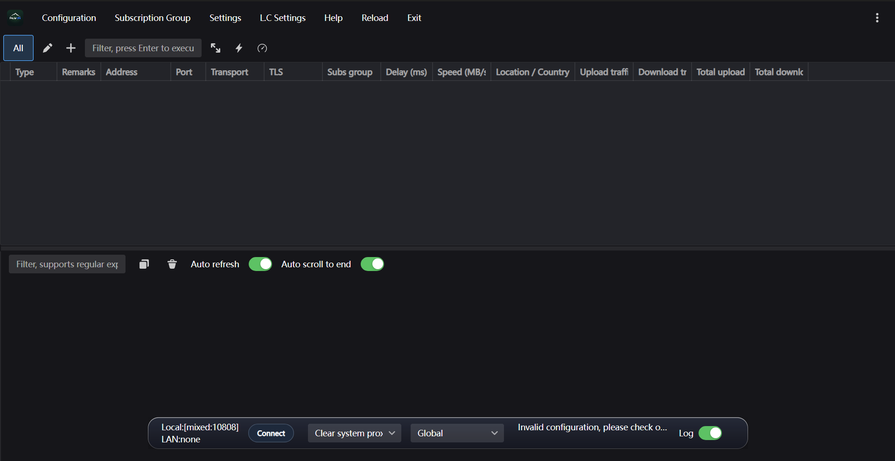

<p align="center">
  
</p>

<h1 align="center">MehrON</h1>

<p align="center">
  <a href="https://github.com/yastorovsky/MehrON/releases/tag/v7.25.47"></a>
  
  <a href="https://github.com/yastorovsky/MehrON/releases"></a>
  <a href="https://github.com/yastorovsky/MehrON/actions/workflows/build.yml"></a>
  <a href="https://github.com/yastorovsky/MehrON/actions/workflows/test.yml"></a>
  
  
  
  <a href="LICENSE"></a>
</p>

<p align="center">
  <a href="README.md">English</a> | <strong>فارسی</strong>
</p>

<p align="center">
  کلاینت دسکتاپ پروکسی برای ویندوز با پروکسی سیستمی، حالت TUN و پشتیبانی از چند هسته —
  ساخته‌شده روی کدبیس PattN / Patterniha، بر پایه‌ی v2rayN.<br />
  ⭐ همراه با <strong>SNI spoofing</strong> و <strong>ریلی MHR</strong> داخلی، برای شرایط قطعی و اضطراری اینترنت.<br />
  🪶 کلاینت سبک با مصرف رم پایین.
</p>

## تصویر برنامه



## ویژگی‌ها

### اتصال
- ایمپورت و مدیریت لینک‌های سابسکریپشن و لینک‌های اشتراکی پشتیبانی‌شده.
- کنترل پروکسی سیستمی ویندوز با یک کلیک، همراه با استثناها و پشتیبانی از PAC.
- حالت TUN اختیاری برای مسیردهی ترافیک کل دستگاه از طریق پروفایل انتخاب‌شده.
- کنترل به‌روزرسانی جداگانه برای هر سابسکریپشن در تنظیمات Subscription Settings.
- ⛓️ **زنجیره‌ی کانفیگ (Double Tunneling):** دو کانفیگ را به هم chain کنید — یک سرور میانی (ورودی) و یک سرور خروجی انتخاب کنید تا ترافیک کاملاً سمت کلاینت از مسیر `کلاینت -> میانی -> خروجی` عبور کند، بدون نیاز به تنظیم سمت سرور (Xray / sing-box).

### هسته‌ها
نسخه‌ی پرتابل به‌همراه ران‌تایم‌های آماده عرضه می‌شود — نیازی به دانلود جداگانه‌ی هسته نیست:

| هسته | کاربرد |
| ---- | ------ |
| Xray | VLESS / VMess / Trojan / Shadowsocks، از جمله Reality و XTLS |
| sing-box | پروتکل‌های مدرن از جمله Hysteria2، TUIC، WireGuard |
| mihomo | مسیردهی مبتنی بر قانون، سازگار با Clash Meta |
| Aether | دور زدن فیلترینگ (MASQUE، WireGuard، پروتکل‌های pluggable transport) |
| 🔥 SNI Spoofing | دور زدن DPI با دستکاری هدر IP/TCP — بدون نیاز به سرور |
| 🛟 ریلی MHR | ریلی domain-fronted با Google Apps Script — فقط با یک اکانت رایگان گوگل |

> [!IMPORTANT]
> **🛡️ آماده برای قطعی و شرایط اضطراری اینترنت:** موتور SNI Spoofing و ریلی MHR برای
> شبکه‌های به‌شدت فیلترشده، اختلال و قطعی جزئی / کامل اینترنت ساخته شده‌اند —
> وقتی پروفایل‌ها و سرورهای عادی از کار می‌افتند، این حالت‌ها می‌توانند شما را متصل نگه دارند.
>
> - **SNI Spoofing:** با دستکاری هدرهای IP/TCP فیلترینگ DPI را دور می‌زند. بدون نیاز به سابسکریپشن یا VPS.
> - **MHR:** ترافیک را از طریق ریلی شخصی شما روی Google Apps Script با تکنیک domain fronting عبور می‌دهد
>   (`مرورگر -> پروکسی محلی -> مسیر Google -> ریلی Apps Script شما -> سایت مقصد`)؛
>   فیلتر شبکه فقط یک اتصال گوگلی می‌بیند. برای سایت‌هایی که IP گوگل را بلاک می‌کنند، exit node اختیاری Cloudflare / VPS قابل اضافه شدن است.

> [!TIP]
> ریلیزهای رسمی پرتابل به‌همراه فایل‌های باینری هسته‌ها (پوشه‌ی `bin/`) و پایگاه‌داده‌های
> مسیریابی به‌روز (`geoip.dat` و `geosite.dat`) عرضه می‌شوند — پیش از اولین اتصال نیازی به
> دانلود جداگانه نیست.

### مسیردهی و DNS
- ویرایشگر بصری قوانین مسیردهی با پیش‌فرض‌های bypass / proxy / direct.
- تنظیمات DNS با پشتیبانی از hijack و FakeIP.
- موتور SNI spoofing و ریلی MHR از بخش هسته‌ها در بالا پیکربندی می‌شوند.

### تنظیمات برای همه
- تنظیمات بر اساس موضوع دسته‌بندی شده‌اند (اتصال، هسته، پروکسی سیستمی، TUN، ظاهر…).
- **حالت مبتدی:** با غیرفعال‌کردن گزینه‌ی *Show advanced settings* در بالای پنجره‌ی Option،
  گزینه‌های Fragment، MUX، منابع به‌روزرسانی و تنظیمات پیشرفته‌ی TUN مخفی می‌شوند.

### تست و نگهداری
- تست تأخیر و سرعت پروفایل با اندپوینت‌های قابل تنظیم.
- آمار سرور، به‌روزرسانی خودکار سابسکریپشن، پشتیبان‌گیری و بازیابی.
- کانال بتا برای بررسی خودکار به‌روزرسانی‌ها.

## شروع سریع (نسخه‌ی پرتابل)

بسته‌ی پرتابل ویندوز به‌صورت `MehrON-windows-64.zip` توزیع می‌شود
(یک آرشیو، بدون زیپ تودرتو).

1. آرشیو را در یک پوشه‌ی قابل‌نوشتن استخراج کنید.
2. فایل `MehrON.exe` را اجرا کنید.
3. هنگام استفاده از حالت TUN یا سایر قابلیت‌هایی که نیاز به دسترسی بالا دارند، پرامپت مدیر ویندوز را تأیید کنید.
4. یک پروفایل ایمپورت کنید یا لینک سابسکریپشن اضافه کنید.

> [!IMPORTANT]
> حالت TUN یک آداپتور شبکه‌ی مجازی نصب می‌کند و به دسترسی مدیر (Administrator) نیاز دارد.
> اگر فقط از حالت پروکسی سیستمی استفاده می‌کنید، نیازی به ارتقای دسترسی نیست.

این ریلیز عمداً فاقد پروفایل، سابسکریپشن، لاگ یا فایل‌های پیکربندی ران‌تایمِ تولیدشده است.

## بیلد از سورس

پیش‌نیازها:

- ویندوز
- .NET SDK نسخه‌ی 10.0 (به فایل `global.json` مراجعه کنید)

بیلد کلاینت دسکتاپ WPF از ریشه‌ی ریپازیتوری:

```powershell
dotnet build .\v2rayN\v2rayN\v2rayN.csproj -c Release
```

خروجی در مسیر `v2rayN\v2rayN\bin\Release\` نوشته می‌شود.

> [!NOTE]
> فایل‌های باینری ران‌تایم توسط بیلد .NET تولید نمی‌شوند. یک ریلیز پرتابل باید فایل‌های
> لازم Xray، sing-box، mihomo و Aether را زیر پوشه‌ی `bin` خودش داشته باشد تا به‌صورت
> مستقل اجرا شود.

## ساختار ریپازیتوری

```text
v2rayN/                      سورس اصلی کلاینت دسکتاپ
_upstream_sni_spoofing/      سورس یکپارچگی SNI spoofing
_upstream_mhr/               سورس یکپارچگی MHR
_upstream_mhr_cfw/           سورس یکپارچگی MHR-CFW
```

## امنیت و حریم خصوصی

> [!WARNING]
> پروفایل‌های شخصی، آدرس‌های سابسکریپشن، پوشه‌های تولیدشده‌ی `guiNConfig`، لاگ‌ها یا
> فایل‌های `config.json` حاوی اطلاعات ورود را کامیت یا منتشر نکنید. در نمونه‌ها از
> placeholder استفاده کنید و داده‌های اتصال خصوصی را خارج از ریپازیتوری نگه دارید.

## مشارکت

از هر Pull Request و کمکی خوشحال می‌شیم — گزارش باگ، ترجمه، مستندات و ایده‌های جدید.

## لایسنس و قدردانی

MehrON تحت لایسنس GPL-3.0 توزیع می‌شود؛ به فایل [LICENSE](LICENSE) مراجعه کنید. این پروژه از کدبیس PattN / Patterniha ساخته شده و شامل یا یکپارچه با پروژه‌های شخص‌ثالثی است که لایسنس و نوتیس‌های خودشان را دارند، از جمله v2rayN، Xray-core، sing-box، Aether، MHR، MHR-CFW و کامپوننت SNI spoofing.
